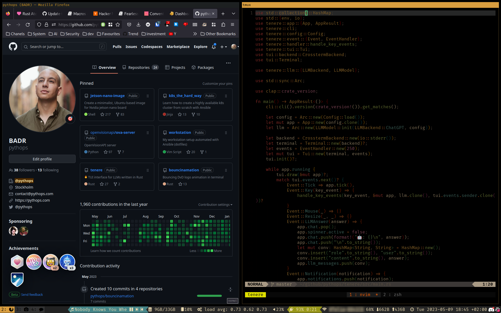

<div align="center">
    
    
    
    <h1>My Workstation Setup </h1>
    
</div>

### 📜 Summary

**OS**: [Arch Linux](https://wiki.archlinux.org/title/Arch_Linux)

**Window Manager**: [i3](https://github.com/i3/i3)

**Terminal emulator**: [wezterm](https://github.com/wez/wezterm)

**Terminal multiplexer**: [tmux](https://github.com/tmux/tmux)

**Tmux plugins**: [plugins](https://github.com/pythops/workstation/blob/master/roles/configure/files/config/tmux/tmux.conf#L60)

**Zsh configuration framework**: [ohmyzsh](https://github.com/ohmyzsh/ohmyzsh)

**Prompt**: [starship](https://github.com/starship/starship)

**Editor**: [NeoVim](https://github.com/neovim/neovim)

**Neovim plugins**: [plugins](https://github.com/pythops/workstation/blob/master/roles/configure/files/config/nvim/lua/plugins/)

**Dev environments**: [Python](), [Rust](), [Go]()

<br>

### 🛠️ Requirements

1. Ansible

```
$ uv venv
$ source .venv/bin/activate
$ uv pip install ansible
$ ansible-galaxy collection install community.general ansible.posix community.crypto
```

> [!NOTE]
> Make sure that $HOME/.local/bin is in your $PATH

2. [just](https://github.com/casey/just) command runner

3. Qemu (Optional)

<br>

### 🔬 Usage

```
$ just configure <target>
```

Available targets:

- all
- audio
- containers
- dnsmasq
- esp
- git
- go
- gpu
- i3
- keyboard
- lua
- minikube
- neovim
- npm
- packages
- python
- rust
- starship
- tmux
- wezterm
- yay
- zsh

<br>

### 📺 Preview

Create an Archlinux VM

```
$ just start-vm
```

Configure the whole VM

```
$ just configure-vm
```

Connect to the VM using a VNC client (tigervnc in this example)

```
 $ vncviewer :5900
```

The credentials are:

```
login: pythops
password: pythops
```

<br>

## ⚖️ License

GPLv3
